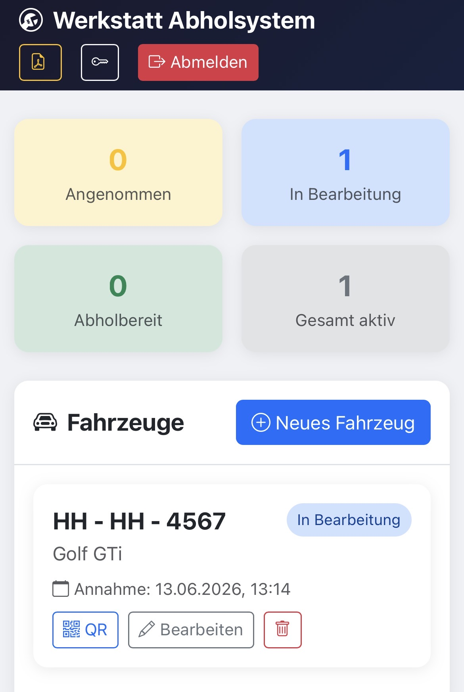
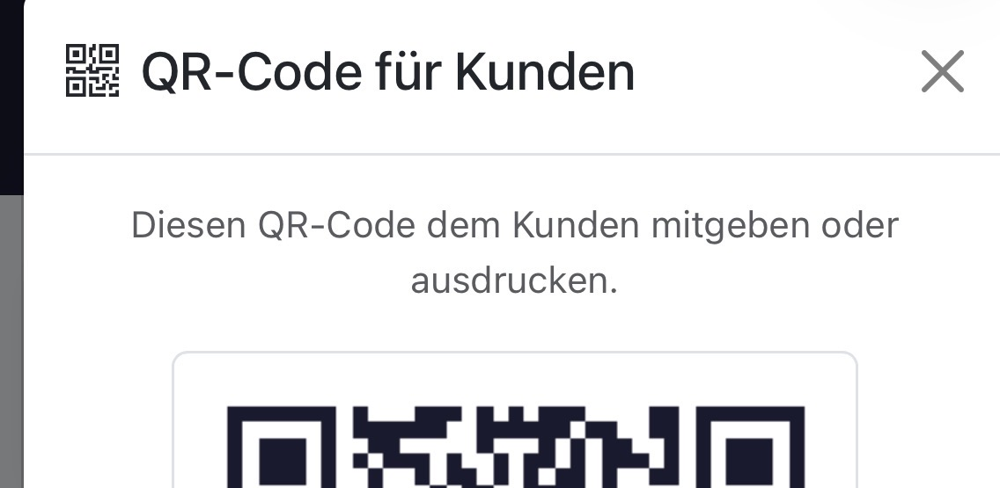
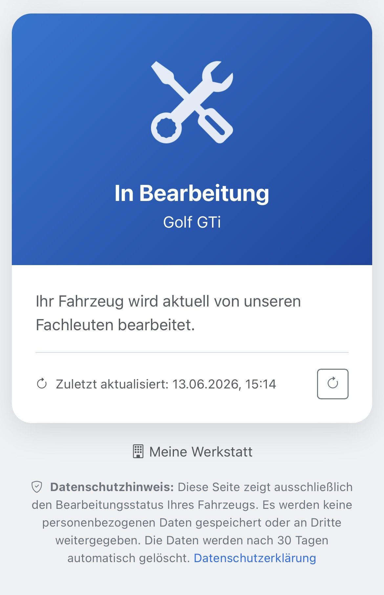
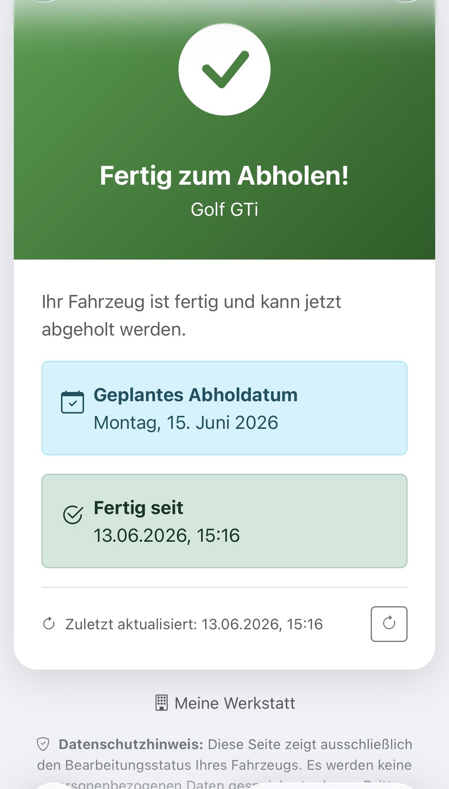
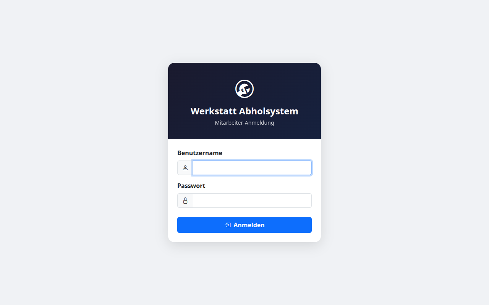

# 🔧 Werkstatt Abholsystem

Ein einfaches, **DSGVO-konformes** System, mit dem Kfz-Werkstätten ihren Kunden den
Reparaturstatus ihres Fahrzeugs anzeigen können. Der Kunde scannt einen QR-Code (oder
öffnet einen Link) und sieht, ob sein Auto **in Bearbeitung**, **fertig** oder
**abholbereit** ist – ohne Anruf, ohne Account.

- ✅ Selbst gehostet – alle Daten bleiben auf **deinem** Server
- ✅ DSGVO-freundlich: nur nötige Daten, automatische Löschung nach X Tagen
- ✅ Optionale E-Mail-Benachrichtigung, wenn das Fahrzeug fertig ist
- ✅ QR-Code-Generierung pro Fahrzeug
- ✅ Läuft komplett ohne externe Dienste

---

## 📸 Screenshots

**Manager-Ansicht** – Übersicht aller Fahrzeuge mit Status, QR-Code und Bearbeiten-Funktion:



**QR-Code** – wird pro Fahrzeug generiert und kann dem Kunden mitgegeben oder ausgedruckt werden:



**Kundenansicht** – was der Kunde sieht, wenn er den QR-Code scannt (kein Login nötig):

| In Bearbeitung | Fertig zum Abholen |
|---|---|
|  |  |

**Login** – Zugang nur für Werkstatt-Mitarbeiter:



---

## ✨ Funktionen


## 🚀 Installation – wähle deinen Weg

Diese App ist eine **Node.js-Anwendung**. Sie läuft **nicht** auf klassischem
PHP-Webspace, aber dafür auf fast allem anderen. Such dir den Weg aus, der zu dir passt:

| Weg                            | Für wen                                 | Schwierigkeit       |
| ------------------------------ | --------------------------------------- | ------------------- |
| **A) PaaS (Render / Railway)** | „Ich will klicken, nicht konfigurieren" | ⭐ einfach           |
| **B) Docker** (selbst bauen)   | Eigener Server / VPS mit Docker         | ⭐⭐ mittel           |
| **C) VPS manuell + HTTPS**     | Voller Funktionsumfang, eigene Domain   | ⭐⭐⭐ fortgeschritten |
| **D) Docker Hub** ⭐ empfohlen  | Schnellster Weg – ein Befehl, fertig   | ⭐ einfach           |

---

### Weg D) Docker Hub – ein Befehl, fertig

Kein Git, kein Bauen – einfach das fertige Image direkt starten:

```bash
docker run -d \
  -p 3000:3000 \
  -e JWT_SECRET=dein-geheimer-schluessel \
  -e BASE_URL=http://localhost:3000 \
  -v werkstatt_data:/data \
  poweruserdockerai/werkstatt-abholung:latest
```

Danach einmalig den Admin-Benutzer anlegen:

```bash
docker exec -it <container-id> node scripts/setup.js
```

Das Image ist verfügbar auf [Docker Hub](https://hub.docker.com/r/poweruserdockerai/werkstatt-abholung).


---

### Weg A) PaaS – ohne Server-Kenntnisse (Render.com)

Am einfachsten für Einsteiger. Kostenloser Tarif zum Ausprobieren vorhanden.

1. Dieses Repository zu deinem eigenen GitHub-Account **forken**.
2. Auf [render.com](https://render.com) anmelden → **New → Web Service**.
3. Dein GitHub-Repo auswählen. Render erkennt Node.js automatisch.
   - **Build Command:** `npm install`
   - **Start Command:** `npm start`
4. Unter **Environment** diese Variablen setzen (siehe [`.env.example`](.env.example)):
   - `JWT_SECRET` → eine lange, zufällige Zeichenkette
   - `BASE_URL` → die URL, die Render dir gibt (z. B. `https://werkstatt.onrender.com`)
   - `DB_PATH` → `/data/werkstatt.db`
5. Ein **Disk** (persistenter Speicher) mit Mount-Pfad `/data` hinzufügen, damit die
   Datenbank Neustarts übersteht.
6. Deployen. Danach **einmalig** den Admin-Benutzer anlegen – in der Render-Shell:
   ```bash
   node scripts/setup.js
   ```

> Railway, Fly.io oder Northflank funktionieren nach dem gleichen Prinzip.

---

### Weg B) Docker – auf deinem eigenen Server

Wenn du einen Server mit Docker hast, ist das der schnellste Weg.

**Variante ohne Reverse Proxy** (z. B. hinter einem bestehenden Proxy / Plesk / nur lokal):

```bash
git clone https://github.com/DEIN-USERNAME/werkstatt-abhol.git
cd werkstatt-abhol

cp .env.example .env
nano .env          # JWT_SECRET, BASE_URL und WERKSTATT_NAME anpassen

docker compose -f docker-compose.simple.yml up -d --build
docker compose -f docker-compose.simple.yml exec app node scripts/setup.js
```

Die App läuft dann auf `http://localhost:3000`.

**Variante mit eingebautem Nginx + Let's Encrypt** (eigene Domain, eigener Server):
siehe Weg C.

---

### Weg C) VPS mit eigener Domain und HTTPS

Voller Funktionsumfang inkl. automatischem SSL-Zertifikat. Empfohlen für den
echten Produktivbetrieb. Detaillierte Schritte stehen in
**[DEPLOYMENT.md](DEPLOYMENT.md)**.

Kurzfassung:

```bash
git clone https://github.com/DEIN-USERNAME/werkstatt-abhol.git
cd werkstatt-abhol
chmod +x deploy.sh
./deploy.sh werkstatt.deinedomain.de deine-email@example.com
docker compose exec app node scripts/setup.js
```

Voraussetzung: Eine Domain, deren A-Record auf die IP deines Servers zeigt.

### Weg D) Docker Hub – ein Befehl, fertig

Kein Git, kein Bauen – einfach das fertige Image starten:

```bash
docker run -d \
  -p 3000:3000 \
  -e JWT_SECRET=dein-geheimer-schluessel \
  -e BASE_URL=http://localhost:3000 \
  -v werkstatt_data:/data \
  poweruserdockerai/werkstatt-abholung:latest
```

Danach Admin-Benutzer anlegen:

```bash
docker exec -it <container-id> node scripts/setup.js
```

Das Image ist verfügbar auf [hub.docker.com/r/poweruserdockerai/werkstatt-abholung](https://hub.docker.com/r/poweruserdockerai/werkstatt-abholung)


---

## ⚙️ Konfiguration

Alle Einstellungen laufen über eine `.env`-Datei. Kopiere die Vorlage und passe sie an:

```bash
cp .env.example .env
```

| Variable | Pflicht | Beschreibung |
|----------|:-------:|--------------|
| `JWT_SECRET` | ✅ | Geheimer Schlüssel für Logins. **Unbedingt ändern!** (min. 32 Zeichen) |
| `BASE_URL` | ✅ | Öffentliche URL deiner Installation (für QR-Codes) |
| `DB_PATH` | ✅ | Speicherort der SQLite-Datenbank |
| `LOESCHUNG_NACH_TAGEN` | – | Nach wie vielen Tagen abgeholte Fahrzeuge gelöscht werden (Standard: 30) |
| `WERKSTATT_NAME` u. a. | – | Kontaktdaten für die Datenschutzerklärung |
| `SMTP_*` | – | E-Mail-Versand (leer lassen = deaktiviert) |

---

## 🔐 Sicherheit & Datenschutz

- **Niemals** die `.env` oder die Datenbank (`*.db`) committen – beides ist in
  `.gitignore` ausgeschlossen.
- Setze **immer** ein eigenes `JWT_SECRET` (z. B. `openssl rand -base64 48`).
- Betreibe die App im Produktivbetrieb **nur über HTTPS**.
- Es werden nur technisch notwendige Daten gespeichert (Kennzeichen, Fahrzeugtyp,
  Status). Abgeholte Fahrzeuge werden automatisch gelöscht.

---

## 🛠️ Tech-Stack

Node.js · Express · SQLite (better-sqlite3) · JWT · Helmet · Docker · Nginx

---

## 📄 Lizenz

[MIT](LICENSE) – frei nutzbar, auch kommerziell. Ohne Gewähr.
